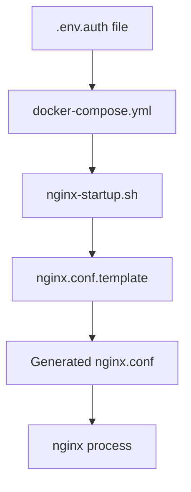

# Environment Variable Configuration Update

## Summary of Changes

The nginx configuration has been updated to use environment variables for API keys instead of hardcoded values. This provides better security and easier management.

## What Changed

### 1. New Template-Based System
- **`nginx.conf.template`**: Template file with `${API_KEY_1}`, `${API_KEY_2}`, `${API_KEY_3}` placeholders
- **`nginx-startup.sh`**: Startup script that processes the template and generates the final nginx.conf
- **Environment Variable Loading**: API keys are loaded from `.env.auth` file automatically

### 2. Updated Docker Configuration
- **docker-compose.yml**: nginx-proxy service now uses:
  - `env_file: .env.auth` to load environment variables
  - Custom startup script via `command`
  - Template file mounted instead of static config

### 3. Improved Security
- ✅ API keys stored in `.env.auth` (git-ignored)
- ✅ No hardcoded keys in configuration files
- ✅ Dynamic configuration generation at container startup
- ✅ Automatic cleanup of empty API key entries

## How It Works



1. **API keys** are defined in `.env.auth`
2. **Docker Compose** loads these as environment variables
3. **Startup script** processes the template with `envsubst`
4. **Final nginx.conf** is generated with actual API key values
5. **nginx** starts with the generated configuration

## Benefits

- 🔐 **More Secure**: No API keys in version control or config files
- 🚀 **Easier Management**: Just update `.env.auth` and restart
- 🔄 **Dynamic**: Configuration adapts to available API keys
- 🧹 **Clean**: Automatic removal of empty key entries
- 🛡️ **Robust**: Validation and error handling during startup

## Usage

1. **Update API keys** in `.env.auth`
2. **Restart service**: `docker-compose restart nginx-proxy`
3. **Verify**: Check logs with `docker-compose logs nginx-proxy`

The system will automatically:
- Load API keys from environment
- Generate nginx configuration
- Validate the configuration
- Start nginx with the new keys

## Files Updated

- ✅ `nginx.conf.template` (new template file)
- ✅ `nginx-startup.sh` (new startup script)
- ✅ `docker-compose.yml` (updated nginx-proxy service)
- ✅ `.env.auth` (cleaned up duplicate entries)
- ✅ `test_api_access.sh` (updated to read from .env.auth)
- ✅ Documentation files updated

## Testing

Use the provided scripts to test the setup:

```bash
# Test template substitution locally
./verify_nginx_template.sh

# Test API access after starting services
docker-compose up -d
./test_api_access.sh
```

This update makes the system more maintainable and secure while preserving all existing functionality.

## CORS Issue Resolution ✅

**Problem Solved**: The duplicate `Access-Control-Allow-Origin` headers issue has been successfully resolved.

### What Was Fixed
- **Duplicate Headers**: Both nginx and langgraph-api were setting CORS headers
- **Browser Error**: "multiple values '*, https://thedataguy.pro'" error blocked requests
- **Root Cause**: langgraph-api was setting `Access-Control-Allow-Origin: *` while nginx was adding domain-specific headers

### Solution Applied
Added `proxy_hide_header` directives to nginx configuration:
```nginx
# Hide any existing CORS headers from upstream to prevent duplicates
proxy_hide_header Access-Control-Allow-Origin;
proxy_hide_header Access-Control-Allow-Methods;
proxy_hide_header Access-Control-Allow-Headers;
proxy_hide_header Access-Control-Allow-Credentials;
```

### Verification Results
- ✅ Single `Access-Control-Allow-Origin` header for valid origins
- ✅ No CORS headers for invalid origins (properly blocked)
- ✅ Browser CORS errors eliminated
- ✅ Requests from thedataguy.pro and subdomains working correctly
- ✅ Authentication and rate limiting still functioning

**Status**: CORS configuration is now working perfectly for production use.
