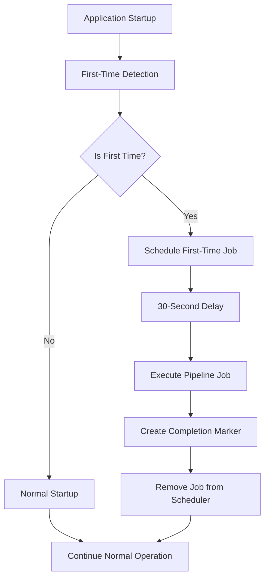

# First-Time Startup Process Documentation

## Overview

The Let's Talk application includes an intelligent first-time execution detection and setup system that automatically initializes the application on its very first run. This system ensures a smooth onboarding experience by automatically running the initial data pipeline to populate the vector database and set up the system for immediate use.

## Table of Contents

1. [How It Works](#how-it-works)
2. [Detection Logic](#detection-logic)
3. [Configuration](#configuration)
4. [First-Time Job](#first-time-job)
5. [Monitoring](#monitoring)
6. [Troubleshooting](#troubleshooting)
7. [Manual Control](#manual-control)
8. [API Integration](#api-integration)

## How It Works

### Automatic Detection

When the application starts up, it automatically checks if this is the first time it's being executed by examining multiple system indicators:

1. **Database State** - Checks if the database is empty or has no migration history
2. **Settings Initialization** - Verifies if application settings have been stored in the database
3. **Vector Storage** - Looks for existing vector storage data
4. **Output Files** - Checks for any previous pipeline execution artifacts
5. **First-Time Marker** - Looks for a completion marker file

### Startup Flow



### Execution Timeline

1. **T+0s**: Application starts, detects first-time execution
2. **T+0s**: Schedules `first_time_pipeline_setup` job with 30-second delay
3. **T+30s**: Pipeline job executes with full data processing
4. **T+30s+**: Job completes, creates marker file, removes itself from scheduler
5. **T+future**: Subsequent startups detect marker and skip first-time setup

## Detection Logic

### Multiple Indicators

The system uses a multi-factor approach to detect first-time execution:

```python
indicators = {
    "database_empty": is_database_empty(),
    "settings_not_initialized": not are_settings_initialized(),
    "no_vector_storage": not has_vector_storage(),
    "no_output_files": not has_output_files()
}
```

### Decision Algorithm

The system considers it a first-time execution if:
- **Majority of indicators** suggest first-time (≥3 out of 4), OR
- **Database is empty** (strong indicator), OR  
- **Half the indicators + no completion marker** exists

### Completion Marker

A marker file is created at `{OUTPUT_DIR}/.first_time_setup_completed` to prevent re-execution on subsequent startups.

## Configuration

All aspects of the first-time setup can be controlled via environment variables:

### Environment Variables

| Variable | Default | Description |
|----------|---------|-------------|
| `FIRST_TIME_DETECTION_ENABLED` | `"True"` | Enable/disable first-time detection |
| `FIRST_TIME_RUN_PIPELINE_JOB` | `"True"` | Whether to run the pipeline job on first-time |
| `FIRST_TIME_JOB_ID` | `"first_time_pipeline_setup"` | ID for the first-time job |
| `FIRST_TIME_JOB_DELAY_SECONDS` | `"30"` | Delay before executing the job |
| `FIRST_TIME_JOB_FORCE_RECREATE` | `"True"` | Force recreation of vector store |

### Configuration Examples

#### Disable First-Time Detection
```bash
export FIRST_TIME_DETECTION_ENABLED="False"
```

#### Custom Delay (2 minutes)
```bash
export FIRST_TIME_JOB_DELAY_SECONDS="120"
```

#### Disable Pipeline Job (detection only)
```bash
export FIRST_TIME_RUN_PIPELINE_JOB="False"
```

## First-Time Job

### Job Configuration

The first-time job runs with optimized settings for initial setup:

```json
{
  "job_id": "first_time_pipeline_setup",
  "force_recreate": true,
  "incremental_mode": "full",
  "ci_mode": true,
  "dry_run": false,
  "health_check": true,
  "should_save_stats": true
}
```

### What It Does

1. **Full Data Processing** - Processes all available data sources
2. **Vector Store Creation** - Creates and populates the vector database
3. **Settings Initialization** - Stores application settings in the database
4. **Health Validation** - Performs system health checks
5. **Statistics Generation** - Creates initial performance statistics
6. **Marker Creation** - Creates the completion marker file

### Job Lifecycle

1. **Scheduled** - Added to scheduler with delay during startup
2. **Executed** - Runs the complete pipeline process
3. **Completed** - Marks setup as complete
4. **Removed** - Automatically removes itself from scheduler

## Monitoring

### Health Endpoint

Check first-time status via the health endpoint:

```bash
curl http://localhost:2024/health
```

**Response includes:**
```json
{
  "status": "healthy",
  "timestamp": "2025-08-09T17:00:00Z",
  "scheduler_status": "running",
  "version": "1.0.0",
  "first_time_setup": {
    "detection_enabled": true,
    "is_first_time": false,
    "setup_completed": true,
    "job_scheduled": false,
    "run_pipeline_job": true
  }
}
```

### Scheduler Status

Check scheduled jobs including first-time job:

```bash
curl http://localhost:2024/scheduler/jobs
```

### Log Messages

Monitor application logs for first-time execution messages:

```
🎉 First-time execution detected!
⏰ First-time pipeline job scheduled
✅ First-time pipeline job setup completed
🎉 First-time setup completed successfully!
```

## Troubleshooting

### Common Issues

#### First-Time Not Detected

**Symptoms:** System doesn't run first-time job despite fresh installation

**Causes:**
- Existing completion marker file
- Database already initialized
- Settings already stored
- Output files from previous runs

**Solutions:**
```bash
# Remove completion marker
rm output/.first_time_setup_completed

# Clear database (SQLite)
rm output/lets_talk.db

# Clear output directory
rm -rf output/*

# Clear vector storage
rm -rf db/*
```

#### Job Not Executing

**Symptoms:** First-time job scheduled but doesn't execute

**Causes:**
- Scheduler not running
- Job delay too long
- Pipeline execution errors

**Debug Steps:**
```bash
# Check scheduler status
curl http://localhost:2024/scheduler/status

# Check job queue
curl http://localhost:2024/scheduler/jobs

# Check logs for errors
tail -f logs/application.log
```

#### Detection Logic Issues

**Symptoms:** Incorrect first-time detection

**Debug:**
```python
from lets_talk.core.first_time import get_first_time_status

# Get detailed status
status = get_first_time_status()
print(status)
```

### Manual Reset

To manually trigger first-time setup:

```bash
# 1. Stop the application
# 2. Remove completion marker
rm output/.first_time_setup_completed

# 3. Optionally clear data
rm -rf output/* db/*

# 4. Restart application
./start_backend_dev.sh
```

## Manual Control

### Disable First-Time Setup

For production deployments where you want to manage initialization manually:

```bash
export FIRST_TIME_DETECTION_ENABLED="False"
```

### Custom Initialization

Run pipeline manually instead of automatic first-time setup:

```bash
# Disable automatic setup
export FIRST_TIME_RUN_PIPELINE_JOB="False"

# Run pipeline manually when ready
uv run python -m lets_talk.pipeline --force-recreate
```

### Pre-populate Data

For deployments with pre-populated data:

```bash
# Create completion marker to skip first-time setup
mkdir -p output
echo "Pre-populated deployment" > output/.first_time_setup_completed
```

## API Integration

### Health Check Integration

The first-time status is automatically included in health checks, making it easy to monitor via:

- **Kubernetes health probes**
- **Load balancer health checks**
- **Monitoring systems**
- **CI/CD pipelines**

### Programmatic Access

```python
from lets_talk.core.first_time import (
    is_first_time_execution,
    get_first_time_status,
    has_first_time_marker
)

# Check if first-time
if is_first_time_execution():
    print("This is a first-time execution")

# Get detailed status
status = get_first_time_status()
print(f"Setup completed: {has_first_time_marker()}")
```

### Scheduler Integration

```python
from lets_talk.core.first_time import setup_first_time_execution_job

# Manually setup first-time job
job_status = setup_first_time_execution_job(scheduler_instance)
```

## Security Considerations

### File Permissions

The completion marker file is created in the output directory with standard permissions. Ensure the application has write access to this directory.

### Data Protection

The first-time job processes all configured data sources. Ensure:

- Data sources are properly secured
- API keys and credentials are configured
- Network access is appropriate for the environment

### Resource Usage

The first-time job performs full data processing which may:

- Use significant CPU and memory
- Make external API calls
- Create large vector indexes
- Generate substantial network traffic

Plan accordingly for resource allocation during initial setup.

## Best Practices

### Development

1. **Test First-Time Flow** - Regularly test the first-time experience
2. **Monitor Resources** - Watch resource usage during first-time setup
3. **Validate Data** - Ensure first-time job processes expected data
4. **Check Health** - Verify health endpoint reports correct status

### Production

1. **Pre-validation** - Test first-time setup in staging environment
2. **Resource Planning** - Allocate adequate resources for initial setup
3. **Monitoring** - Set up alerts for first-time job execution
4. **Backup Strategy** - Consider backing up completion marker

### CI/CD

1. **Environment Reset** - Clear state between test runs
2. **Status Validation** - Check first-time status in deployment tests
3. **Health Monitoring** - Include health checks in deployment validation

## Version History

- **v0.1.5** - Initial implementation of first-time detection and setup
- **Future** - Planned enhancements for distributed deployments

## Related Documentation

- [Pipeline Usage Guide](PIPELINE_USAGE_GUIDE.md) - Manual pipeline execution
- [Scheduler Documentation](SCHEDULER.md) - Job scheduling system
- [Health Monitoring](API_DOCUMENTATION.md) - Health endpoint details
- [Configuration Guide](CONFIGURATION.md) - Environment variables
